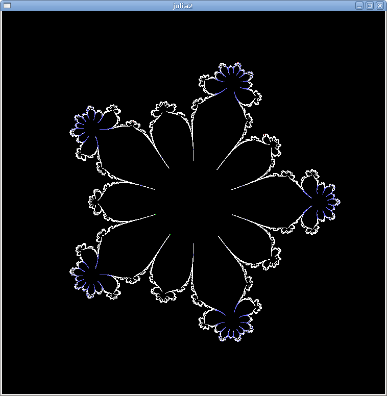
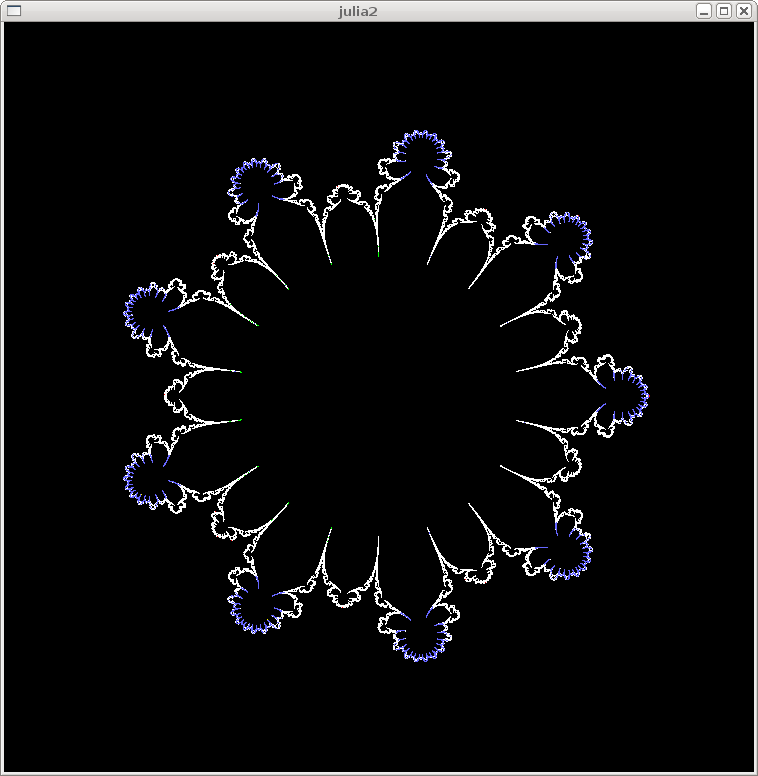
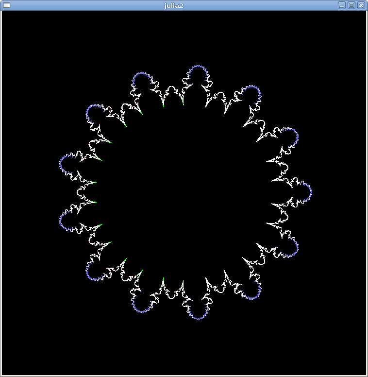
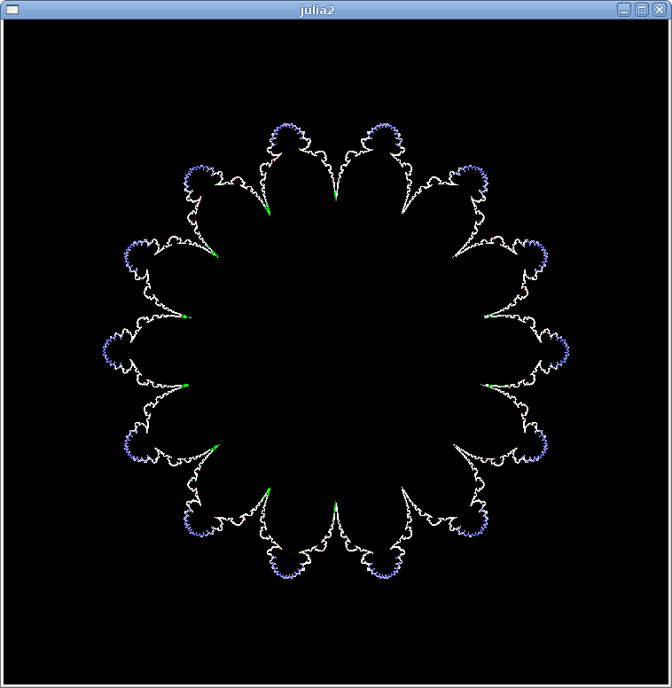

[Some Julia sets by Michael Becker, 8/2003](https://web.archive.org/web/20161024132306/http://www.ijon.de/mathe/julia/index.html)


#  original images z^n - z

## n is even 
   

   

   

## n is odd 
   

   


# code 
[original code from 2005](./src/2005) under [GNU GPL licence](http://gnugpl.org/)


See also new not original code and images: 
* [b036.png - original image](https://web.archive.org/web/20161024194536im_/http://www.ijon.de/mathe/julia/sets/b036.png) and [the same image with the src code in commons  ](https://commons.wikimedia.org/wiki/File:Julia_set_f(z)%3D1_over_az5%2Bz3%2Bbz.png)
* [b011.png original image](https://web.archive.org/web/20161024194536im_/http://www.ijon.de/mathe/julia/sets/b011.png) and [the same image with the src code in commons](https://commons.wikimedia.org/wiki/File:Julia_set_p(z)%3D_z%5E3%2B(1.0149042485835864102%2B0.10183008497976470119i)*z.png)
* [b011.png original image](https://web.archive.org/web/20161024194536im_/http://www.ijon.de/mathe/julia/sets/b011.png) and [zoom of the same image with the src code  in commons](https://commons.wikimedia.org/wiki/File:Julia_set_p(z)%3D_z%5E3%2B(1.0149042485835864102%2B0.10183008497976470119i)*z;_(zoom).png)
* [b012.png - original image](https://web.archive.org/web/20161024194536im_/http://www.ijon.de/mathe/julia/sets/b012.png) and [the same image with the src code in commons ](https://commons.wikimedia.org/wiki/File:Julia_set_for_f(z)_%3D_z%5E3_%2Bz*(0.1008317508132964*i_%2B_1.004954206930806).png)
* [b015.png - original image](https://web.archive.org/web/20160504150529im_/http://www.ijon.de/mathe/julia/sets/b015.png) and [the same image with the src code in commons ]( https://commons.wikimedia.org/wiki/File:Julia_set_for_f(z)%3D_z%5E14-z.png#%7B%7Bint%3Afiledesc%7D%7D)


# compiling and running original code on Ubuntu 21.04


Simple compilation failed   


```
 make
cc -Wall -g -I /usr/include/glib-1.2 -I /usr/include/gtk-1.2 -I /usr/lib/glib/include  -c complex.c
cc -Wall -g -I /usr/include/glib-1.2 -I /usr/include/gtk-1.2 -I /usr/lib/glib/include  -c imagearea.c
In file included from imagearea.c:12:
imagearea.h:4:10: fatal error: glib.h: No such file or directory
    4 | #include <glib.h>
      |          ^~~~~~~~
compilation terminated.
make: *** [makefile:16: imagearea.o] Error 1
```

Help
* [unix.stackexchange: how-to-install-gtk-1-2-on-new-system](https://unix.stackexchange.com/questions/658860/how-to-install-gtk-1-2-on-new-system)
* [multilib-and-multiarch](https://unix.stackexchange.com/questions/458069/multilib-and-multiarch)
  * [ubuntu: MultiArch](https://help.ubuntu.com/community/MultiArch) and [MultiarchSpec](https://wiki.ubuntu.com/MultiarchSpec)
  * [debian Multiarch](https://wiki.debian.org/Multiarch/)
  * [stackoverflow: force-gcc-to-compile-32-bit-programs-on-64-bit-platform](https://stackoverflow.com/questions/3501878/force-gcc-to-compile-32-bit-programs-on-64-bit-platform)
* [GTK v1.2 Tutorial by Tony Gale and Ian Main ](https://www.mit.edu/afs.new/sipb/project/gtk/gtk_v1.2/tutorial/html/gtk_tut.html#toc23)
* [GTK+ version 1.2.10. GTK+](https://github.com/dimkr/gtk)


## dependencies


[Hardware architecture supported by Ubuntu and it's Ubuntu Designation](https://help.ubuntu.com/lts/installation-guide/armhf/ch02s01.html)
* Intel x86-based (32 bit) = i386 
* AMD64 & Intel 64 (64 bit) = amd64 
* ARM with hardware FPU	= armhf	
* 64bit ARM = arm64
* IBM POWER Systems = ppc64el 
* IBM z/Architecture = armhf

OS
* [stackoverflow: how-to-determine-whether-a-given-linux-is-32-bit-or-64-bit](https://stackoverflow.com/questions/246007/how-to-determine-whether-a-given-linux-is-32-bit-or-64-bit)
* [Linux (software) architecture : kernel/shell/applications](https://www.tutorialspoint.com/operating_system/os_linux.htm)

[libraries](/src/Makefile)  
* glib-1.2 
* gtk-1.2 


Packages
* ["you might find it easier to install the amd64 versions instead of the i386 versions; that would avoid the hassle of dealing with the -common package on both architectures." Stephen Kitt](https://unix.stackexchange.com/questions/658860/how-to-install-gtk-1-2-on-new-system)
* packages from [/debian-archive/debian/pool/main/g](http://archive.debian.org/debian-archive/debian/pool/main/g/)

Result :  


```bash
ldd ./julia2 
	linux-vdso.so.1 (0x00007ffdb04ee000)
	libgtk-1.2.so.0 => /lib/libgtk-1.2.so.0 (0x00007f003fd81000)
	libgdk-1.2.so.0 => /lib/libgdk-1.2.so.0 (0x00007f003fb43000)
	libglib-1.2.so.0 => /lib/libglib-1.2.so.0 (0x00007f003f918000)
	libm.so.6 => /lib/x86_64-linux-gnu/libm.so.6 (0x00007f003f7ca000)
	libc.so.6 => /lib/x86_64-linux-gnu/libc.so.6 (0x00007f003f5de000)
	libgmodule-1.2.so.0 => /lib/libgmodule-1.2.so.0 (0x00007f003f3dc000)
	libdl.so.2 => /lib/x86_64-linux-gnu/libdl.so.2 (0x00007f003f3d3000)
	libXi.so.6 => /lib/x86_64-linux-gnu/libXi.so.6 (0x00007f003f3c1000)
	libXext.so.6 => /lib/x86_64-linux-gnu/libXext.so.6 (0x00007f003f3ac000)
	libX11.so.6 => /lib/x86_64-linux-gnu/libX11.so.6 (0x00007f003f26e000)
	/lib64/ld-linux-x86-64.so.2 (0x00007f004010e000)
	libxcb.so.1 => /lib/x86_64-linux-gnu/libxcb.so.1 (0x00007f003f244000)
	libXau.so.6 => /lib/x86_64-linux-gnu/libXau.so.6 (0x00007f003f23c000)
	libXdmcp.so.6 => /lib/x86_64-linux-gnu/libXdmcp.so.6 (0x00007f003f234000)
	libbsd.so.0 => /lib/x86_64-linux-gnu/libbsd.so.0 (0x00007f003f21c000)
	libmd.so.0 => /lib/x86_64-linux-gnu/libmd.so.0 (0x00007f003f20f000)
```


# git
```git
git init
git add README.md
git commit -m "first commit"
git branch -M main
git remote add origin https://github.com/adammaj1/Some-Julia-sets-by-Michael-Becker-.git
git push -u origin main
```


## Subdirectory

```git
mkdir images
git add *.png
git mv  *.png ./images
git commit -m "move"
git push -u origin main
```

then link the images:


```
 
```


```
gitm mv -f 
```
