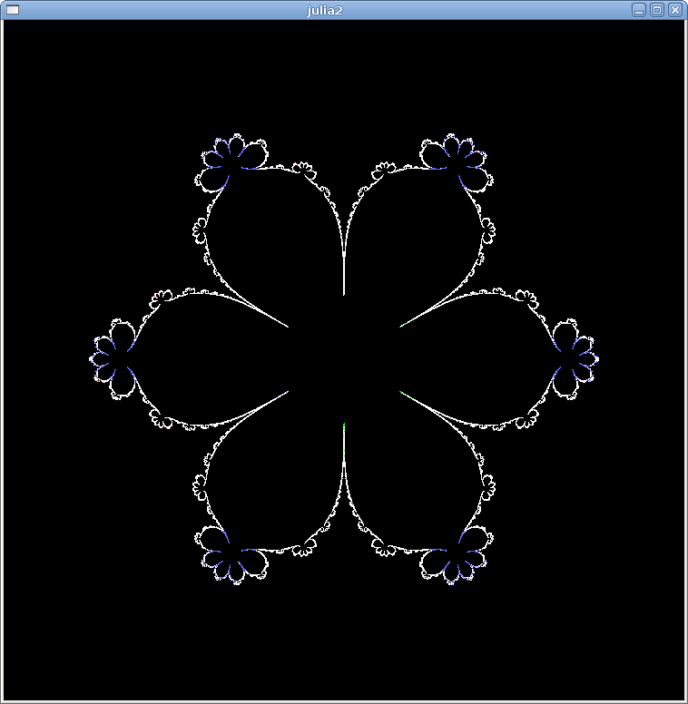

[Some Julia sets by Michael Becker, 8/2003](https://web.archive.org/web/20161024132306/http://www.ijon.de/mathe/julia/index.html)


#  original images z^n - z

## n is even 
   

   

   

## n is odd 
   

   


# code 
[original code from 2005](./src/2005) under [GNU GPL licence](http://gnugpl.org/)


See also new not original code and images: 
* [b036.png - original image](https://web.archive.org/web/20161024194536im_/http://www.ijon.de/mathe/julia/sets/b036.png) and [the same image with the src code in commons  ](https://commons.wikimedia.org/wiki/File:Julia_set_f(z)%3D1_over_az5%2Bz3%2Bbz.png)
* [b011.png original image](https://web.archive.org/web/20161024194536im_/http://www.ijon.de/mathe/julia/sets/b011.png) and [the same image with the src code in commons](https://commons.wikimedia.org/wiki/File:Julia_set_p(z)%3D_z%5E3%2B(1.0149042485835864102%2B0.10183008497976470119i)*z.png)
* [b011.png original image](https://web.archive.org/web/20161024194536im_/http://www.ijon.de/mathe/julia/sets/b011.png) and [zoom of the same image with the src code  in commons](https://commons.wikimedia.org/wiki/File:Julia_set_p(z)%3D_z%5E3%2B(1.0149042485835864102%2B0.10183008497976470119i)*z;_(zoom).png)
* [b012.png - original image](https://web.archive.org/web/20161024194536im_/http://www.ijon.de/mathe/julia/sets/b012.png) and [the same image with the src code in commons ](https://commons.wikimedia.org/wiki/File:Julia_set_for_f(z)_%3D_z%5E3_%2Bz*(0.1008317508132964*i_%2B_1.004954206930806).png)
* [b015.png - original image](https://web.archive.org/web/20160504150529im_/http://www.ijon.de/mathe/julia/sets/b015.png) and [the same image with the src code in commons ]( https://commons.wikimedia.org/wiki/File:Julia_set_for_f(z)%3D_z%5E14-z.png#%7B%7Bint%3Afiledesc%7D%7D)


# compiling original code on Ubuntu 21.04

[dependecies](/src/Makefile)
* glib-1.2 
* gtk-1.2 

Short description : compilation failed   


```
 make
cc -Wall -g -I /usr/include/glib-1.2 -I /usr/include/gtk-1.2 -I /usr/lib/glib/include  -c complex.c
cc -Wall -g -I /usr/include/glib-1.2 -I /usr/include/gtk-1.2 -I /usr/lib/glib/include  -c imagearea.c
In file included from imagearea.c:12:
imagearea.h:4:10: fatal error: glib.h: No such file or directory
    4 | #include <glib.h>
      |          ^~~~~~~~
compilation terminated.
make: *** [makefile:16: imagearea.o] Error 1
```


## glib1.2

[how-to-install-glib-1-2-on-new-system](https://unix.stackexchange.com/questions/658788/how-to-install-glib-1-2-on-new-system)
* don't build
* use packages built for old Ubuntu 
  * download deb packages: [libglib1.2_1.2.10-17build1_i386.deb](http://old-releases.ubuntu.com/ubuntu/pool/main/g/glib1.2/libglib1.2_1.2.10-17build1_i386.deb) and [libglib1.2-dev_1.2.10-17build1_i386.deb](http://old-releases.ubuntu.com/ubuntu/pool/main/g/glib1.2/libglib1.2-dev_1.2.10-17build1_i386.deb)
  * install using: apt install

```
sudo apt install ./libglib1.2_1.2.10-17build1_i386.deb
sudo apt install ./libglib1.2-dev_1.2.10-17build1_i386.deb
```


After that next try to compile the program

```
make
cc -ansi -Wall -g -I /usr/include/glib-1.2 -I /usr/include/gtk-1.2 -I /usr/lib/glib/include  -c julia2.c
julia2.c:8:10: fatal error: gtk/gtk.h: Nie ma takiego pliku ani katalogu
    8 | #include <gtk/gtk.h>
      |          ^~~~~~~~~~~
compilation terminated.
make: *** [makefile:16: julia2.o] Błąd 1
```
Now it lacks gtk, not glib


# git
```git
git init
git add README.md
git commit -m "first commit"
git branch -M main
git remote add origin https://github.com/adammaj1/Some-Julia-sets-by-Michael-Becker-.git
git push -u origin main
```


## Subdirectory

```git
mkdir images
git add *.png
git mv  *.png ./images
git commit -m "move"
git push -u origin main
```

then link the images:


```
 
```


```
gitm mv -f 
```
